# SmartHire AI

> Distributed AI platform for live coding interviews, candidate profile optimization, ATS scoring, and recruiter-grade analytics.

   

---


## Overview

SmartHire AI automates the full technical hiring lifecycle. It orchestrates live interview sessions with real-time AI feedback, scores and optimizes candidate profiles (CV, LinkedIn, GitHub), evaluates code submissions in secure Docker sandboxes, and gives recruiters structured analytics to make faster, more consistent hiring decisions.

**Why SmartHire AI?**

- **Standardizes** technical interviews with structured prompts, objective scoring rubrics, and sandboxed code execution.
- **Automates** resume, LinkedIn, and GitHub optimization so candidates are ranked on signal, not formatting.
- **Scales** recruiter workflows with real-time WebSocket sessions, voice AI, and AI-generated feedback across every interview.

---

## Features

| Area | What it does |
|---|---|
| **AI Interview Engine** | Orchestrates live sessions — question flow, timing, real-time state via WebSocket, AI prompt generation and scoring |
| **CV / Profile Optimizer** | Scores and rewrites resumes, LinkedIn profiles, and GitHub presence via Python AI workers |
| **ATS Scoring** | Analyses job-fit and compatibility with applicant tracking systems |
| **Assessment Module** | Manages question banks, runs assessments, stores results, supports AI-generated questions |
| **Jobs Module** | Job posting, resume storage, AI-augmented job description scoring via NVIDIA adapters |
| **Learning Roadmap** | Recommends upskilling content from Udemy, Coursera, and YouTube based on candidate gaps |
| **Voice AI (STT/TTS)** | Whisper / whisper.cpp pipeline with pluggable cloud provider adapters |
| **Secure Code Execution** | Docker-sandboxed evaluation with CPU/memory limits — no host exposure |
| **Face Recognition** | Optional proctoring and profile verification service (privacy opt-in) |
| **Event Management** | Async, event-driven workflows for domain events and service integrations |

---

## Architecture

### Service Map

| Service | Language | Responsibility |
|---|---|---|
| `Gateway/` | Java / Spring Cloud Gateway | Single entry point — routing, auth checks, role-based permissions (port 8887) |
| `ConfigServer/` | Java / Spring Cloud Config | Centralized, Git-backed config for all services |
| `Discovery/` | Java / Spring Eureka | Service registry for runtime service-to-service discovery |
| `MS-User/` | Java / Spring Boot | Accounts, roles (candidate / recruiter / admin), JWT auth, user profiles |
| `MS-Interview/` | Java / Spring Boot | Live interview orchestration, WebSocket state management, AI prompt coordination |
| `MS-Assessment/` | Java / Spring Boot | Question banks, scoring engine, results storage; dev + docker profiles |
| `MS-Job/` | Java / Spring Boot | Job postings, resume storage, AI-augmented JD scoring via NVIDIA adapters |
| `MS-Profile/` | Java / Spring Boot | GitHub / LinkedIn / CV enrichment and optimization via Python AI workers |
| `MS-Roadmap/` | Java / Spring Boot | Upskilling recommendations via Udemy / Coursera / YouTube APIs |
| `MS-EventManagement/` | Java / Spring Boot | Async event-driven workflows and domain event handling |
| `AI-Advice/` | Python | CV advice, prompt orchestration, job-matching text transforms (HTTP API) |
| `FaceRecognition-Service/` | Python | Face detection for interview proctoring and profile verification (optional) |

### Tech Stack

| Layer | Technology |
|---|---|
| Frontend | Angular SPA |
| API Gateway | Spring Cloud Gateway |
| Microservices | Java 17, Spring Boot |
| AI Workers | Python 3.10+, scikit-learn, face_recognition |
| AI Providers | OpenAI, Ollama, NVIDIA, Groq, ElevenLabs (all via runtime keys) |
| Voice | Whisper / whisper.cpp |
| Database | MySQL (per-service schemas) |
| RAG (optional) | Vector DB — Milvus / Pinecone / Weaviate |
| Orchestration | Docker Compose (local), Kubernetes (production) |

---

## Quick Start (Local — Docker)

**Prerequisites:** Docker, Docker Compose, Java 17+, Node 20+, Python 3.10+

```bash
# 1. Set up environment variables
cp .env.example .env
# Edit .env — add DB passwords, API keys, and provider credentials

# 2. Build and start all services
docker compose build
docker compose up -d

# 3. (Optional) Run the frontend in dev mode with hot reload
cd frontend
npm ci
npm start
```

| Service | Default URL |
|---|---|
| Frontend | http://localhost:4200 |
| API Gateway | http://localhost:8887 |

> **AI provider keys** (OpenAI, NVIDIA, Groq, ElevenLabs) are resolved at runtime from environment variables — never hardcode them in source.

---

## Project Structure

```
smarthire-ai/
├── backend/
│   ├── ConfigServer/            # Centralized Spring Cloud Config
│   ├── Discovery/               # Eureka service registry
│   ├── Gateway/                 # API gateway (port 8887)
│   ├── MS-User/                 # Auth and user management
│   ├── MS-Interview/            # Interview orchestration + WebSocket
│   ├── MS-Assessment/           # Assessments and scoring
│   ├── MS_JOB/                  # Job postings and resume storage
│   ├── MS-Profile/              # Profile enrichment and optimization
│   ├── MS-Roadmap/              # Learning roadmap recommendations
│   ├── MS-EventMangement/       # Async event handling
│   ├── AI-Advice/               # Python AI worker (CV, advice, matching)
│   └── FaceRecognition-Service/ # Python face recognition (optional)
├── frontend/                    # Angular SPA
├── k8s/                         # Kubernetes manifests
└── docs/                        # Architecture diagrams and screenshots
```

---


## Deployment (Kubernetes)

```bash
# Apply manifests
kubectl apply -f k8s/

# Inject secrets — never via committed YAML
kubectl create secret generic smarthire-secrets \
  --from-literal=DB_PASSWORD=... \
  --from-literal=OPENAI_API_KEY=...

# CI/CD: build each Java service
./mvnw -DskipTests package
docker build -t registry/smarthire-<service>:<tag> .
docker push registry/smarthire-<service>:<tag>
```

---

## Troubleshooting

```bash
# Stream logs for a specific service (Docker)
docker compose logs -f <service>

# Kubernetes pod status
kubectl -n <namespace> get pods
kubectl logs <pod-name>
```

---
